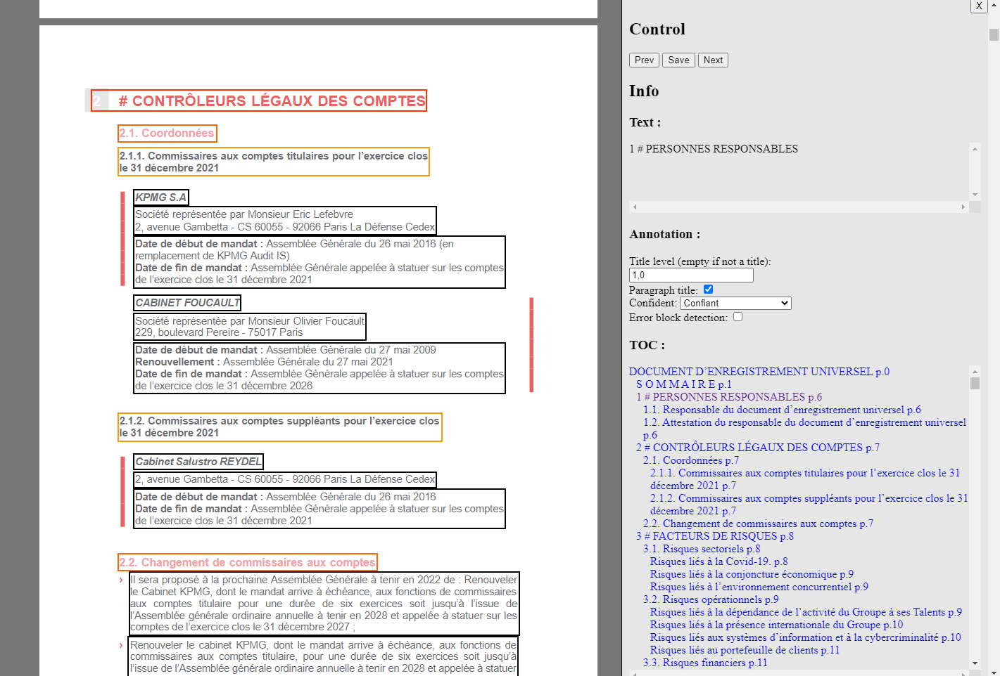

# Automatic Title Extraction from Financial Documentation PDFs (2023)
## AMF - ENS Data Challenge



*Can we teach a machine to reconstruct the full structure of long French-listed companies financial documents : titles, headings, and all hierarchical levels using nothing more than noisy OCR text blocks and layout metadata?*

**Each PDF is broken into hundreds or thousands of small blocks of text. For each block, we only know:**

- its raw text,
- its font size, font style, color,
- its position on the page,
- its bounding box dimensions,
- its page number,
- and the document it comes from.

Nothing else. No layout. No visual rendering. Just metadata and noisy text.

### The challenge: 
Predict whether this block is a title or not, and if yes, which of 8 hierarchical levels it corresponds to. This reconstructed structure can then serve as a direct input for downstream NLP tasks, such as LLM-based summarization, section-aware QA, or automated extraction of financial insights.

## Problems to solve

Several factors make this classification task uniquely challenging:

- **Massive class imbalance:** more than 95% of blocks are not titles.
- **Deep title levels (5–8) are extremely rare:** very few positive examples to learn from.
- **Heterogeneous formatting across PDFs:** font sizes, colors, spacing, bold usage, page templates… nothing is consistent between documents.
- **OCR noise and text irregularities:** strange characters, inconsistent spacing, partial tokens.
- **Layout without visual rendering:** We never see the actual page. Only numbers and text.

Despite this, part of the structure is learnable: if the feature engineering is strong and the validation strategy mirrors the real generalisation conditions.

## Understanding the target

The target is a hierarchical structural label:

- 0 → not a title
- 1 to 8 → title levels (1 = major section, 8 = deep subsection)

This is essentially document skeleton reconstruction from metadata.

Titles differ from normal text through a mixture of subtle cues: larger or smaller font size, uppercase usage, numbering patterns (1., 1.2.3…), boldness, position on page, specific keywords ("SOMMAIRE"…), and spacing patterns.

The model must learn these signals indirectly.

## How the modelling pipeline is built

The idea behind the notebook rests on three complementary components.

1. **Extract structure from text + layout**  
    Raw numeric and textual attributes are transformed into meaningful signals:
    - text length, word count, uppercase ratio
    - number of digits and punctuation marks
    - detection of hierarchical numbering
    - ALL CAPS detection
    - block width/height
    - parsed font size from strings like "507px"
    - RGB color extraction
    - bold detection from font and font_style
    - document-level and page-level vertical normalization

    These features allow a machine to approximate the typographic and structural cues humans rely on.

2. **Document-aware normalization**  
    Every PDF has its own internal style. If we don’t normalize internally, the model learns:
    - “in this PDF, font 18 is a title,
    - in that PDF, font 12 is a title…”

    which fails on unseen documents. Instead, we normalize:
    - font size relative to the document median,
    - vertical position relative to document height,
    - block positions relative to page height.

    This step is crucial for cross-document generalisation.

3. **Multiclass LightGBM with class imbalance handling**  
    A LightGBM classifier is trained on:
    - only numeric layout/text features,
    - inverse-frequency class weights,
    - early stopping to avoid overfitting,
    - a validation split by document (not by row), so the model is tested on unseen PDFs.

    Once the best iteration is found, the model is retrained on the whole training set and run on all test blocks.

The final file is formatted as required:

```
file,idx,annotation
2021-054000,0,
2021-054000,1,0.0
...
```

## Evaluation

Predictions are uploaded to the ENS platform : *https://challengedata.ens.fr/challenges/86*

The server compares our predicted title levels to the hidden ground truth. Only the AMF has access to the true annotations.

The evaluation is a pure multiclass score, no target smoothing, no guessing, no post-hoc tuning possible. Everything must be validated internally.

## My Results

After building a balanced feature set, handling the extreme class imbalance, and training a weighted LightGBM classifier, the final model achieved:

- **Public leaderboard score** : 0.31
- **Current ranking** : 6 / 32 participants

The predictions are stable, consistent with the internal validation results, and provide a reliable structural reconstruction of financial reports.

## What’s inside the notebook?

- Structured data loading
- Target reconstruction (0 → non-title, 1–8 → title levels)
- Extensive textual + layout feature engineering
- Document-level normalization
- Class imbalance weighting
- LightGBM multiclass model
- Out-of-sample evaluation on unseen PDFs
- Final retraining and test prediction
- Submission file creation

All fully reproducible.

## Limits & future extensions

Some potential improvements include:

- richer relational features (block spacing, indentation patterns)
- TF-IDF or MiniLM text embeddings
- two-stage modelling: first detect “title vs not title”, then predict level 1–8
- focal loss for rare classes
- cross-document k-fold validation
- small layout-aware models (GNNs, coordinate embeddings)

These could improve deeper title levels, which remain the hardest part.

---

**Alexandre Mathias DONNAT, Sr**
