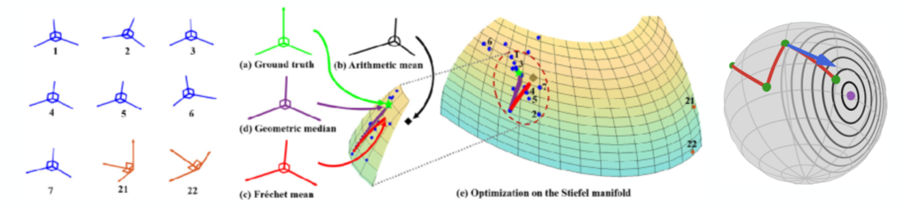

# Learning Linear Factors for Stock Market Return Prediction (2022)

## QRT - ENS Data Challenge
*Equity Markets & Geometric Modelling*

*Can we design a set of linear factors that turn noisy past returns into a stable, directional signal for tomorrow's cross-sectional equity returns?*

*Our data provides, for each stock and each day, a clean history of daily returns over three years. Each 250-day window is mapped to a future cross-section of returns. The "signal''—the next-day equity return vector—is extremely noisy, with faint structure relative to idiosyncratic fluctuations, which makes factor discovery fundamentally difficult.*

## Context

Given daily returns $R_t \in \mathbb{R}^N$ for $N$ stocks at time $t$, construct a portfolio vector $S_{t+1} \in \mathbb{R}^N$ using only information up to time $t$, such that $\langle S_{t+1}, R_{t+1} \rangle > 0$ as often as possible. The challenge uses a linear factor model:

$$S_{t+1} = \sum_{\ell=1}^{F} \beta_\ell\, F_{t,\ell}$$

- $F_{t,\ell} \in \mathbb{R}^N$: explanatory factors (cross-sectional tilts)  
- $\beta_1, \ldots, \beta_F \in \mathbb{R}$: scalar factor weights

Classical factors are handcrafted (5-day averages, momentum, volatility). Here, factors are learned as linear combinations of past returns.

### Learning factors from past returns

Each factor is a linear function of past returns over a fixed depth $D$. For $D = 250$:

$$F_{t,\ell} = \sum_{k=1}^{D} A_{k\ell}\, R_{t+1-k}$$

where $A_\ell \in \mathbb{R}^D$ is the temporal filter of factor $\ell$, and $A = [A_1, \ldots, A_F] \in \mathbb{R}^{D \times F}$. To avoid redundancy:

$$A^\top A = I_F$$

placing $A$ on the Stiefel manifold.

**Parameters**

- $A \in \mathbb{R}^{D \times F}$ with orthonormal columns  
- $\beta \in \mathbb{R}^F$ (global factor weights)

### Challenge settings

- Time depth: $D = 250$  
- Number of factors: $F = 10$

**Evaluation metric: Average normalized overlap**

For test returns $\tilde{R}_t \in \mathbb{R}^{50}$ and predictions $\tilde{S}_t(A, \beta)$:

$$\text{Metric}(A,\beta) = \frac{1}{504} \sum_{t=250}^{753} \frac{\langle \tilde{S}_t, \tilde{R}_t \rangle}{\|\tilde{S}_t\|_2 \, \|\tilde{R}_t\|_2}, \quad \text{s.t.} \quad \bigl|\langle A_i, A_j \rangle - \delta_{ij}\bigr| \le 10^{-6}$$

otherwise $\text{Metric}(A,\beta) = -1$.

- Values lie in $[-1, 1]$ (cosine similarity)  
- Any orthonormality violation → score $-1$

## Mathematical Approach

Learn:

- $A \in \mathbb{R}^{D \times F}$ with $A^\top A = I_F$  
- $\beta \in \mathbb{R}^F$

Given past returns $X_t \in \mathbb{R}^{N \times D}$:

- Latent factors: $F_t = X_t A \in \mathbb{R}^{N \times F}$  
- Predicted returns: $\hat{Y}_t = F_t \beta \in \mathbb{R}^{N}$

Optimization:

$$\max_{A, \beta} \frac{1}{T_{\text{eff}}} \sum_t \frac{\langle \hat{Y}_t, Y_t \rangle}{\|\hat{Y}_t\|_2 \, \|Y_t\|_2} \quad \text{s.t.} \quad A^\top A = I_F$$

A non-linear constrained problem on the Stiefel manifold.

### Exponential Map on the Stiefel Manifold

Parametrize orthonormality exactly:

1. Learn an antisymmetric matrix $G^\top = -G \in \mathbb{R}^{D \times D}$.  
2. Compute $U = \exp(G)$.  
3. Set $A = U[:, :F]$.

The exponential of an antisymmetric matrix is orthogonal, so $A^\top A = I_F$ holds exactly—no projections or penalties. Optimize via PyTorch (Adam, 200 epochs).

## My results

- **Public leaderboard metric**: ≈ 0.0838  
- **In-sample metric**: ≈ 0.14  
- **Perfect orthonormality, robust across seeds** 
- **Final rank: 140 / 360** on *https://challengedata.ens.fr/participants/challenges/72/*

## What's Inside the notebook

- **Data prep**: 50 stocks, 754 days; rolling windows $X \in \mathbb{R}^{504 \times 50 \times 250}$; targets $Y \in \mathbb{R}^{504 \times 50}$
- **Stiefel utilities**: orthonormality checks, exact metric
- **ModelExp**: antisymmetric generator → exponential map → orthogonal filters; full PyTorch pipeline
- **Training loop**: direct metric maximization, Adam, best-model tracking; no projections/penalties

## Further Ideas & Extensions

- **Alternative optimization**: penalty $\lambda \|A^\top A - I_F\|_F^2$; Lagrange multipliers; uniform Stiefel sampling + $\beta$ regression
- **Ensembling**: multi-start runs; keep best or ensemble predictions
- **Structured $G$**: banded/sparse generators for short-memory or interpretability
- **Regularization/validation**: $\ell_2$ on $\beta$; time-wise folds; early stopping
- **Hybrid approaches**: combine learned filters with handcrafted priors (5-day returns, momentum, volatility)

